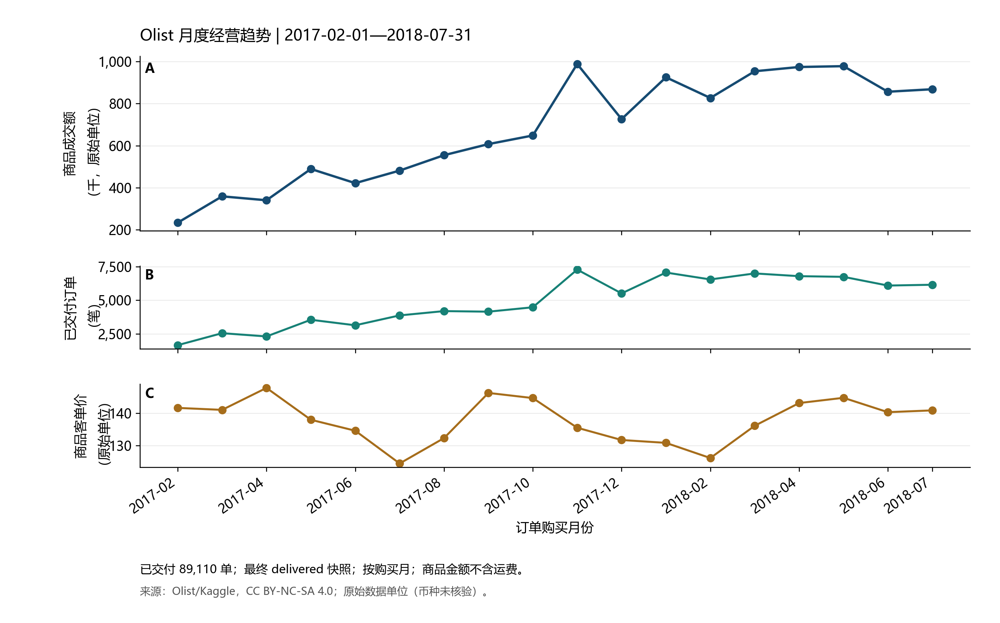

# Olist Business Analysis

### Reproducible commerce and delivery analysis with SQL and Power BI

**Trace business questions through explicit metric definitions, ten SQL analyses, quality checks and an editable two-page Power BI project.** The project uses Olist's historical public data and distinguishes observed associations from causal claims.

English | [中文](README_ZH.md)

[Quick start](#quick-start) · [Findings](reports/analysis-summary.md) · [Metrics](docs/metrics.md) · [Reproduction guide](docs/reproduce.md)



*Actual SQL analysis output, in source currency units. This chart is an analysis figure, not a Power BI screenshot.*

## What is implemented

- Seven typed source tables, separate order and item facts, and shared date/state dimensions; item categories do not filter order KPIs.
- Q01–Q10: commerce trends, an exact order-count-first decomposition of order count and AOV, category and state contributions, delivery distributions, rating sensitivity by month/state, and mature 30-day repeat-purchase cohorts.
- Blocking checks for conflicting keys, amounts, joins, fact grain and exported metric consistency. Each run is immutable; failed runs preserve the previous successful pointer.
- Anonymous dashboard exports, explicit DAX denominators, and an editable PBIP/PBIR project validated against Microsoft's JSON schemas.
- Offline synthetic business tests and an official-source download pinned by SHA-256.

**Verification:** offline business tests, blocking SQL quality checks, exported amount reconciliation, and Microsoft PBIR JSON schema checks have passed. Desktop refresh, actual DAX comparison and PBIX/PDF snapshots are excluded from this delivery. The editable Power BI project is provided with these runtime checks unperformed. See the [validation record](docs/validation.md).

## Actual data snapshot

The official source contains 99,441 orders and 112,650 items. The analysis window is **2017-02-01 to 2018-07-31**, comprising 18 calendar months after inspecting source coverage.

| Metric | Full analysis window |
|---|---:|
| Delivered orders, final snapshot status | 89,110 |
| Delivered merchandise amount, excluding freight | 12,230,652.13 source units |
| Merchandise amount per delivered order | 137.25 source units |
| Late deliveries / eligible delivery dates | 6,116 / 89,102 (6.86%) |
| Valid ratings / delivered orders | 88,497 / 89,110 (99.31%) |

Amounts are not revenue or profit. The source metadata used here does not explicitly confirm currency, so the report does not label amounts as BRL. No refund transactions or browsing exposure are available; refund rates and conversion funnels are not fabricated. See [findings and limitations](reports/analysis-summary.md).

## Quick start

Requirements: Python 3.9+ and [uv](https://docs.astral.sh/uv/). Power BI Desktop is optional for later interactive report validation. Run from the repository root:

```sh
uv venv --python 3.9
uv pip install --python .venv -r requirements-dev.txt
uv run --no-project --python .venv python scripts/download_data.py
uv run --no-project --python .venv python scripts/run.py
```

The downloader rejects any archive that differs from the pinned official snapshot. If Kaggle changes it, review the new data rather than disabling the checksum. For offline use, pass `--archive /path/to/brazilian-ecommerce.zip`.

`build/current.json` identifies the last successful run. Use that run directory for the two builders:

```sh
uv run --no-project --python .venv python scripts/build_reports.py --run-dir build/runs/<run_id> --output-dir reports
uv run --no-project --python .venv python scripts/build_dashboard.py --run-dir build/runs/<run_id> --output-dir dashboard
uv run --no-project --python .venv python -m pytest -q
```

Replace `<run_id>` with the value in `build/current.json`. For optional Desktop validation, open `dashboard/Olist.pbip` and set **DataFolder** to the absolute `dashboard/data` directory before refreshing. See the [reproduction guide](docs/reproduce.md) for platform-specific commands, report interactions and DAX comparison steps.

## Evidence and navigation

| Material | Purpose |
|---|---|
| [One-page findings](reports/analysis-summary.md) | Observations, evidence, next investigation and limits |
| [Metric dictionary](docs/metrics.md) | Grain, numerator/denominator, time window and missing values |
| [Data model](docs/data-model.md) | Facts, dimensions and filter directions |
| [SQL analyses](sql/analysis) | Q01–Q10, including window functions and cohorts |
| [Quality report](reports/quality-report.md) | Actual source issues, blocking checks and runtime |
| [30-day cohort table](reports/cohort-30d.csv) | Mature denominators and partial observation |
| [Dashboard comparisons](dashboard/reconciliation) | Three SQL/DAX contexts and independently calculated expected values |
| [Manual calculations](tests/fixtures/manual_checks.md) | Small Q02/Q07/Q10 examples you can verify by hand |
| [Interview walkthrough](docs/interview-guide.md) | Explain and reproduce the project before using résumé wording |

Customer-level Q09 exports and the DuckDB database remain local. Public dashboard data omit customer/order/product identifiers and review text.

## Attribution and use

Source: [Brazilian E-Commerce Public Dataset by Olist](https://www.kaggle.com/datasets/olistbr/brazilian-ecommerce). Adapted data materials are **CC BY-NC-SA 4.0**, with attribution, noncommercial use and share-alike conditions. Microsoft schemas retain their MIT license. Original code copyright belongs to cloudwallker; no separate code reuse license has been selected. See [NOTICE](NOTICE.md) and [source provenance](docs/data-source.md).
