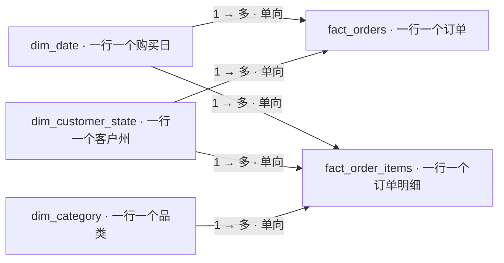

# 数据模型与关联粒度

模型采用两张事实表和三张维表，共五条从维度到事实的单向一对多筛选关系。SQL 仓库保留全源历史供客户序列分析；公开 Power BI 专用导出限制到 2017-02-01—2018-07-31，并删除订单、客户、商品标识及评价原文。

| 表 | 本地业务键/粒度 | 职责与字段 |
|---|---|---|
| `fact_orders` | `order_id` 唯一，每订单一行 | 状态、购买时间/日期、客户州、`customer_unique_id`、商品金额/运费/支付总额、实际/预计送达、所选评分及样本标记 |
| `fact_order_items` | `(order_id, order_item_id)` 唯一，每明细一行 | 商品、品类、`price`/`freight_value`、订单状态、购买日及客户州 |
| `dim_date` | `date` 唯一，每自然日一行 | 月首、年、季度、月份；SQL 覆盖源日期与配置范围，BI 导出重建完整报告窗口，并添加月份标签 |
| `dim_customer_state` | `customer_state` 唯一 | 两张事实共用的客户收货州及 `UNKNOWN` 成员 |
| `dim_category` | `category` 唯一 | 明细专用；优先使用英语翻译，未翻译保留葡语原名，缺原品类为 `UNKNOWN` |

## 五条关系

| 一端维度键 | 多端事实键 | 筛选方向 |
|---|---|---|
| `dim_date.date` | `fact_orders.purchase_date` | 日期 → 订单 |
| `dim_date.date` | `fact_order_items.purchase_date` | 日期 → 明细 |
| `dim_customer_state.customer_state` | `fact_orders.customer_state` | 州 → 订单 |
| `dim_customer_state.customer_state` | `fact_order_items.customer_state` | 州 → 明细 |
| `dim_category.category` | `fact_order_items.category` | 品类 → 明细 |

两张事实没有直接关系，也不设置双向筛选。共享日期和州保证两页采用同一购买日与客户地区范围。品类只能过滤商品明细金额；不设置全局品类切片器。经营页品类图对其他图表的外向交互关闭，避免用户把明细筛选误解为订单/物流指标筛选。

BI 的 `category_group` 根据完整窗口商品金额生成固定 Top10 和“其他”；切换日期或州仍使用这一组定义，不能把图名写成“当前筛选Top10”。未知品类及未翻译品类都保留其金额。

## 为什么先聚合再关联

订单明细、支付和评价都可能一订单多行。当前 [`01_facts.sql`](../sql/models/01_facts.sql) 分别将明细金额和支付金额按订单聚合，将评价按规则缩减为每订单一条，然后连接订单和客户。假设一订单有 2 条明细、2 条支付、2 条评价，直接连接可能形成 8 行，求和会重复金额；订单级连接前先缩减各表粒度可以避免这种放大。

评价按回答时间降序、创建时间降序、评价 ID 升序选择，空时间置后；所有选择键仍相同而评分冲突属于阻断质量问题。客户通过 `customer_id` 关联订单，但客户复购使用 `customer_unique_id`。客户收货州从订单对应客户记录取得，不能改用卖家州。

`SELECT DISTINCT` 只去完全相同记录；同业务键内容冲突不得静默覆盖。必要质量门禁包括事实键唯一、连接后订单/明细行数稳定、明细与订单金额一致、缺物流订单仍保留经营金额。状态、日期和金额检查的实际结果读取成功运行目录中的 `quality.json`。

## 本地模型与公开 BI 导出

本地 `build/runs/<run_id>/csv/` 含完整模型、10 个分析输出及客户序列标识，供复现和排错，不直接公开。`scripts/build_dashboard.py` 生成另一个明确字段白名单的 `dashboard/data/`：订单表保留一订单一行，但移除 `order_id` 等标识，因此 DAX 使用 `COUNTROWS`，依赖上游粒度验收；不能在匿名导出后再凭缺少 ID 做去重。

BI 导出保留日期、州、状态、金额、物流/评分标记及少量必要字段。`q09_customer_observed_sequence.csv` 不进入 BI，复购 cohort 为独立附表，不与明细连接。匿名化不改变原数据许可，适用的衍生数据遵守 [CC BY-NC-SA 4.0](https://creativecommons.org/licenses/by-nc-sa/4.0/)。

[`model.bim`](../dashboard/Olist.SemanticModel/model.bim) 中五条关系均设置 `crossFilteringBehavior: oneDirection`。文件模型与 JSON 格式检查不等于 Power BI Desktop 已完成刷新、交互、DAX 和 PBIX 验收；实际桌面验证证据须另行记录。
